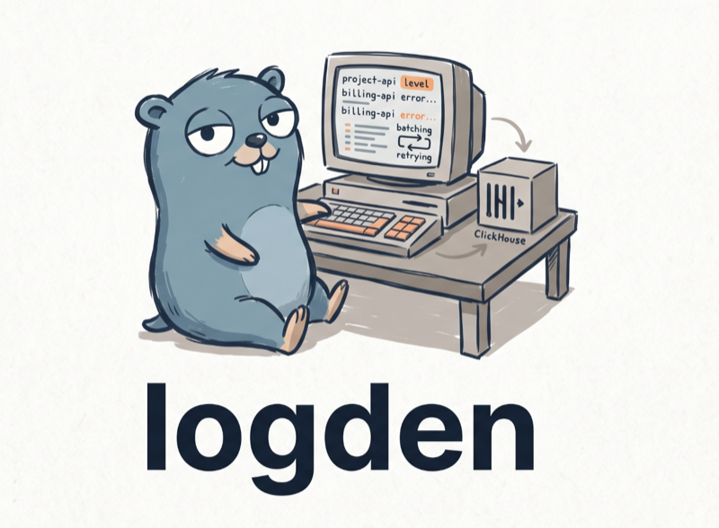

# logden

<p align="center">
  
</p>

A compact centralized logging system for multiple projects.
Any service ships a log with a single HTTP POST → a tiny Go gateway batches and
writes to ClickHouse → analyze with plain SQL. Built for a ~1 GB RAM VPS, with
minimal dependencies (the gateway uses only the Go stdlib).

[](https://github.com/ginkida/logden/actions/workflows/ci.yml)
[](https://github.com/ginkida/logden/releases)
[](https://github.com/ginkida/logden/pkgs/container/logden)
[](gateway/go.mod)
[](LICENSE)

> **AI agents:** see [AGENTS.md](AGENTS.md) — a step-by-step operating guide
> with verifiable commands for deploying, sending logs, and querying.

## Features

- **Simple universal API** — `POST /logs` with a shared token; a single object,
  a JSON array, NDJSON, or gzip. Any client can send: Laravel, Node, Python, cron, bash.
- **Reliability (on the gateway side)** — batching, retries with backoff, a disk spool,
  and automatic replay: logs survive a brief outage and restart of
  ClickHouse. Clients, meanwhile, are deliberately thin and do not retry (see `clients/`).
- **Observability** — Prometheus `/metrics`, readiness `/readyz`, `/version`,
  structured logging (slog/JSON).
- **Compactness** — the gateway uses ~10-15 MB RAM, ClickHouse is tuned for 768 MB; logs
  compress 10-30×, with automatic partition-based retention.
- **Security** — shared token (with rotation), rate limiting, input validation,
  read-only/cap-drop container, ClickHouse not exposed externally.

## Architecture

```
any service (Laravel / Node / Python / cron / bash)
        │  POST /logs   { project, level, message, context, timestamp? }
        │  Authorization: Bearer <shared token>
        ▼
┌──────────────────────────────────────┐
│   logden (Go, ~10-15 MB RAM)          │
│   token → validation → buffer → batch │
│   retries + backoff → disk spool      │
│   /metrics /readyz /version           │
└──────────────────┬───────────────────┘
                   │ batch INSERT (JSONEachRow, wait_for_async_insert)
                   ▼
            ┌──────────────┐
            │  ClickHouse  │  table logs.logs, TTL 30 days, cap 768 MB
            └──────┬───────┘
                   │ SQL, read-only (reader)
                   ▼
                agent / analysis
```

ClickHouse is not published externally; only the gateway port is reachable from outside.

## API contract

```
POST /logs
Authorization: Bearer <LOG_TOKEN>
Content-Type: application/json
Content-Encoding: gzip            (optional)

{
  "project":   "billing-api",     // required: [A-Za-z0-9._-], up to 64 chars
  "level":     "error",           // opt.; normalized (warn→warning), defaults to info
  "message":   "Payment timeout",  // required; truncated if it exceeds the limit
  "context":   { "order_id": 123 },// opt.; any JSON
  "timestamp": "2026-06-02T10:00:00Z" // opt.; RFC3339 or unix (sec/ms); otherwise ingest time
}
```

- **Batch:** the body may be a JSON array `[ {...}, {...} ]` or NDJSON (one object per line).
- **Levels** are PSR-3: `debug`, `info`, `notice`, `warning`, `error`, `critical`, `alert`,
  `emergency`. Five aliases are normalized — `warn`→`warning`, `err`→`error`,
  `fatal`→`critical`, `panic`→`emergency`, `trace`→`debug` — and anything else becomes `info`.
- **Size handling differs by field:** an oversized `message` is **truncated** (byte-wise, with a
  `…[truncated]` suffix), an oversized `context` is **discarded** and replaced by
  `{"_truncated":true,"_orig_bytes":N}` — both counted in
  `logden_logs_truncated_total{field}`. A `context` that is not valid JSON is replaced by
  `{"_invalid_json":true}` (the event is still stored, and this one is not counted).
- **Partial accept:** invalid batch elements are skipped (the
  `logden_logs_rejected_total{reason="invalid_event"}` metric), valid ones are accepted; the whole
  batch is rejected (`400`) only if none are valid — that request is counted once as
  `reason="all_invalid"`.
- **Event time:** a missing or unusable `timestamp` is stamped by the gateway when the event is
  accepted, not when the row reaches ClickHouse — a batch replayed from the spool after an outage
  keeps the time it actually happened. A client time more than 5 minutes in the future or older
  than `RETENTION` is discarded the same way and counted in
  `logden_logs_restamped_total{reason}`.
- Response: `204 No Content` (returned after the event enters the buffer, not after the insert).
- **Error bodies are JSON:** every non-`204` answer from `/logs` is `{"error":"<reason>"}`
  with `Content-Type: application/json; charset=utf-8`. The reason is a closed vocabulary,
  so a sender can tell an invalid project name from an oversized body without access to
  `/metrics`:

  | reason | status | meaning |
  |---|---|---|
  | `method` | `405` | not `POST` (the answer carries `Allow: POST`) |
  | `auth` | `401` | missing or unknown token (`WWW-Authenticate: Bearer`) |
  | `empty` | `400` | body held no events |
  | `bad_json` | `400` | malformed JSON, a truncated array, or trailing garbage |
  | `bad_gzip` | `400` | `Content-Encoding: gzip` that does not decompress |
  | `read_error` | `400` | the body could not be read to the end |
  | `all_invalid` | `400` | every event in the batch failed validation |
  | `too_large` | `413` | body over `MAX_BODY_BYTES` (checked on the wire *and* on the gunzipped stream) |
  | `too_many_events` | `413` | more than `MAX_BATCH_EVENTS` events |
  | `rate_limited` | `429` | `RATE_LIMIT_RPS` bucket empty (`Retry-After: 1`) |
  | `overloaded` | `503` | admission control shedding, `MAX_INFLIGHT_BODY_BYTES` (`Retry-After: 1`) |
  | `buffer_full` | `503` | in-memory buffer full (`Retry-After: 1`) |

  Every reason above except `buffer_full` also labels `logden_logs_rejected_total`;
  `buffer_full` is response-only, because a buffer-full drop is counted by
  `logden_logs_dropped_total` and `deploy/alerts.yml` keys a separate rule on the rejected
  counter. `invalid_event` is the other way round — a per-event metric label only, never a
  response body, since a batch with one bad element is still accepted (`204`). Only `/logs`
  answers JSON; `/healthz`, `/readyz` and `/metrics` keep the plain-text bodies container
  probes and scrapers already expect.
- The token can be sent in `Authorization: Bearer <…>` or in the `X-Log-Token: <…>` header.
- `source_ip` is set by the gateway (see `TRUSTED_PROXIES`).

### Service endpoints

| Path        | Purpose                                                 |
|-------------|---------------------------------------------------------|
| `/healthz`  | liveness (always 200, does not touch ClickHouse)        |
| `/readyz`   | readiness (200/503 — checks ClickHouse availability)    |
| `/metrics`  | Prometheus metrics                                      |
| `/version`  | version/commit/build date                               |

## Quick start (Docker)

```bash
cp .env.example .env
# set LOG_TOKEN and passwords: openssl rand -hex 32
docker compose up -d --build
```

Without building from source — use the prebuilt image from ghcr (published on release tag `v*`):
```bash
# in .env: GATEWAY_IMAGE=ghcr.io/ginkida/logden:0.4.0
docker compose pull gateway && docker compose up -d
```

On the first start of an empty `ch-data` volume ClickHouse runs the schema and creates the
two users, and its healthcheck (`wget --spider http://clickhouse:8123/ping`) stays red for
the whole of that — up to the 60 s `start_period`. The gateway waits on
`depends_on: service_healthy`, so `docker compose ps` until both containers say `healthy`
before sending anything. A warm restart passes on the first probe.

Check:
```bash
set -a; . ./.env; set +a
curl -fsS -X POST http://localhost:8080/logs \
  -H "Authorization: Bearer $LOG_TOKEN" \
  -d '{"project":"demo","level":"error","message":"hello"}'

docker compose exec clickhouse clickhouse-client \
  --user reader --password "$CH_READER_PASSWORD" \
  -q "SELECT * FROM logs.logs ORDER BY timestamp DESC LIMIT 5"
```

The gateway port `:8080` listens on the host loopback only by default (`GATEWAY_BIND=127.0.0.1`) —
expose it externally through a TLS reverse proxy (see [SECURITY.md](SECURITY.md)) or
deliberately set `GATEWAY_BIND=0.0.0.0`. ClickHouse is not published externally at all. The
`ch-data` volume holds ClickHouse data, the `gw-spool` volume — the gateway buffer for outages.

## Installation without Docker (bare metal)

1. **ClickHouse** — copy `clickhouse/config.d/*` and `clickhouse/users.d/*`
   into `/etc/clickhouse-server/`, plus `docker/clickhouse-access.xml` →
   `/etc/clickhouse-server/users.d/` (grants `default` the right to create
   users for `users.sql` and locks it to loopback). Restart, then:
   ```bash
   clickhouse-client --multiquery < clickhouse/schema.sql
   ```
   `clickhouse/users.sql` is tracked and holds **no usable credential**: the two
   passwords are `__WRITER_HASH__` / `__READER_HASH__` sentinels, and ClickHouse
   refuses a `sha256_hash` that is not 64 hex characters, so piping the file in
   as-is aborts on the first statement. Substitute the hashes from the
   environment instead — no plaintext reaches disk or the shell history:
   ```bash
   pwhash() { printf '%s' "$1" | sha256sum | cut -d' ' -f1; }
   # no sha256sum (BSD/macOS)?  openssl dgst -sha256 -r | cut -d' ' -f1
   set -a; . ./.env; set +a
   sed -e "s/__WRITER_HASH__/$(pwhash "$CH_WRITER_PASSWORD")/" \
       -e "s/__READER_HASH__/$(pwhash "$CH_READER_PASSWORD")/" clickhouse/users.sql \
     | clickhouse-client --multiquery
   ```
   If you would rather keep an edited copy, copy it to
   `clickhouse/users.local.sql` and edit that — `.gitignore` covers `*.local.sql`
   so real credentials cannot be committed. Never edit the tracked file in place.
   The statements are `CREATE USER OR REPLACE`, so re-running this is also how a
   password is rotated (it drops hand-added grants; everything the two accounts
   need is re-granted by the file itself).
2. **Gateway** — `make build`, put the binary in `/usr/local/bin/`, configure
   `deploy/logden.env.example` → `/etc/logden.env`, install
   `deploy/logden.service` and `systemctl enable --now logden`.

## Clients

Ready-made modules with batching — `clients/` (Go package, Python, Node), documented
together in [clients/README.md](clients/README.md).
**bash** — `examples/curl.sh`. **Laravel** — `examples/LoggerGatewayHandler.php`.

Clients are deliberately thin: they **do not retry and do not spool**; if the gateway is
unavailable the event is lost. All delivery reliability lives on the gateway → ClickHouse
leg, where it can be durable. What the clients do is make the loss visible — batch mode
never sends on the caller's stack, its buffer is bounded (oldest dropped first, counted and
reported), and every background failure goes to an error sink whose default is *not* silence
(stdlib `log` in Go, `console.error` in Node, one stderr line in Python).

No library is required, though — the contract is one POST. Raw examples:

**Node.js**
```js
await fetch(`${process.env.LOG_GATEWAY_URL}/logs`, {
  method: 'POST',
  headers: { Authorization: `Bearer ${process.env.LOG_TOKEN}`, 'Content-Type': 'application/json' },
  body: JSON.stringify({ project: 'web', level: 'error', message: 'boom', context: { path: '/checkout' } }),
});
```

**Python**
```python
import os, requests
requests.post(f"{os.environ['LOG_GATEWAY_URL']}/logs",
    headers={"Authorization": f"Bearer {os.environ['LOG_TOKEN']}"},
    json={"project": "worker", "level": "warning", "message": "retry", "context": {"attempt": 3}},
    timeout=2)
```

## Gateway configuration (env)

| Variable             | Default                  | Description                                     |
|----------------------|--------------------------|-------------------------------------------------|
| `LOG_TOKEN`          | —                        | shared token(s), comma-separated; required       |
| `LISTEN_ADDR`        | `:8080`                  | listen address                                  |
| `CLICKHOUSE_URL`     | `http://127.0.0.1:8123`  | ClickHouse address; `scheme://host[:port]` only — a path, query, fragment or embedded credentials are refused at startup |
| `CLICKHOUSE_USER`    | `writer`                 | user for inserts                                |
| `CLICKHOUSE_PASSWORD`| —                        | password (or `*_FILE`)                          |
| `BATCH_SIZE`         | `500`                    | batch size                                      |
| `BUFFER_SIZE`        | `2000`                   | in-memory buffer capacity (events)              |
| `BUFFER_MAX_BYTES`   | `33554432`               | byte cap on the buffer + in-flight batch (0 = off) |
| `MAX_INFLIGHT_BODY_BYTES` | `16777216`          | bytes of request bodies in flight, charged as read; above → `503` (0 = off) |
| `FLUSH_INTERVAL`     | `1s`                     | flush interval                                  |
| `MAX_RETRIES`        | `3`                      | insert retries before spooling                  |
| `SPOOL_DIR`          | (empty)                  | disk spool directory; empty = disabled          |
| `SPOOL_MAX_BYTES`    | `268435456`              | byte cap on the spool dir, `.bad` included (0 = off) |
| `REPLAY_INTERVAL`    | `30s`                    | spool replay interval                           |
| `RATE_LIMIT_RPS`     | `0`                      | request rate limit per second (0 = off)          |
| `RATE_BURST`         | `0` (=`RATE_LIMIT_RPS`)  | token bucket burst size                          |
| `TRUSTED_PROXIES`    | (empty)                  | CIDR of trusted proxies for `X-Forwarded-For`   |
| `METRICS_TOKEN`      | (empty)                  | token for `/metrics`; empty = open              |
| `LOG_LEVEL`          | `info`                   | gateway log level                               |
| `MAX_MESSAGE_BYTES`  | `65536`                  | message size cap                                |
| `MAX_CONTEXT_BYTES`  | `65536`                  | context size cap                                |
| `MAX_BODY_BYTES`     | `4194304`                | whole request body cap (source of 413)          |
| `MAX_BATCH_EVENTS`   | `1000`                   | maximum events per request                      |
| `SPOOL_MAX_FILES`    | `1000`                   | cap on the number of batches in the spool        |
| `RETENTION`          | `720h`                   | discard client timestamps older than (≈ TTL)    |
| `CLICKHOUSE_DB` / `_TABLE` | `logs` / `logs`    | database/table name                             |

The source of truth for config is `loadConfig` in `gateway/main.go`.
Secrets can be supplied via file: `LOG_TOKEN_FILE`, `CLICKHOUSE_PASSWORD_FILE`,
`METRICS_TOKEN_FILE` (the file wins over the plain variable, and is trimmed).
`LOG_TOKEN` is split on commas and newlines only — a token may contain spaces.

Two things worth knowing before you tune anything:

- **A value that does not parse is silently ignored** and the default is used
  instead — a typo in a duration or a number will not stop the gateway, it will just
  not take effect. Check `/version` and the startup log line rather than assuming.
- **The byte caps are validated against each other at startup**, and a violation is a
  refusal to start (exit 2), not a warning: a non-zero `BUFFER_MAX_BYTES` must be
  `>= 2 × MAX_BODY_BYTES` (a serialized row is larger than the raw body it came from)
  and a non-zero `MAX_INFLIGHT_BODY_BYTES` must be `>= MAX_BODY_BYTES` (one max-size
  request has to fit). So raising `MAX_BODY_BYTES` alone breaks the boot — raise all
  three together, along with `mem_limit`/`GOMEMLIMIT`. `MAX_BATCH_EVENTS > BUFFER_SIZE`
  is only a startup *warning*, but it means a full-size client batch can never be
  accepted, not even on an idle gateway.

## Analysis

Ready-made queries — `clickhouse/queries.sql` (analytics + monitoring). Connect with the
read-only `reader` user. Full-text search — via `hasToken(message, …)`
(uses a skip index). Connecting an agent/MCP to the read-only `reader` —
[docs/agent-access.md](docs/agent-access.md).

## Observability

`/metrics` exposes (Prometheus): `logden_logs_received_total`,
`logden_logs_inserted_total`, `logden_logs_dropped_total`,
`logden_clickhouse_insert_failed_total`, `logden_clickhouse_insert_retries_total`,
`logden_clickhouse_reachable`, `logden_spool_files`, `logden_spool_bytes`,
`logden_spool_capacity_bytes`, `logden_spool_quarantined_total`,
`logden_buffer_events`, `logden_buffer_capacity`, `logden_buffer_bytes`,
`logden_buffer_capacity_bytes`, `logden_inflight_body_bytes`,
`logden_inflight_body_capacity_bytes`, `logden_process_start_time_seconds`,
`logden_logs_rejected_total{reason}`, `logden_logs_truncated_total{field}`,
`logden_logs_restamped_total{reason}`, `logden_http_requests_total{path,code}`,
`logden_project_logs_received_total{project}`,
`logden_project_logs_dropped_total{project}`, `logden_project_labels_tracked`,
`logden_project_labels_capacity`,
`logden_clickhouse_insert_duration_seconds` (histogram), `logden_build_info`.
The per-project counters are capped at 64 distinct projects: `project` arrives
over the wire, so an unbounded label set would be a scrape-time OOM vector.
Past the cap a new project counts under `project="<overflow>"` — the charset
`project` is validated against cannot produce that name, so nothing can hide
inside the bucket — and `logden_project_labels_tracked` vs
`logden_project_labels_capacity` shows when that is happening.
ClickHouse has its built-in prometheus endpoint enabled on `:9363` (not published externally).
Ready-made alert rules — `deploy/alerts.yml` (gateway target down, drops, insert failures,
shed traffic, CH unavailability, spool growth by files and bytes, buffer fill by events and
by bytes, insert latency, restart loop, ClickHouse memory and free disk, a per-project dead
man's switch, label-cap saturation and timestamp rewrites); an example Prometheus scrape
config — `deploy/prometheus.yml.example`. Renaming a metric breaks these rules.

## Production

- **TLS** — the token and logs go over HTTP; put a reverse proxy (caddy/nginx) with
  TLS in front of the gateway, and have the gateway itself listen on loopback. See [SECURITY.md](SECURITY.md).
- **Memory limits** — `docker-compose.yml` sets `mem_limit` (a hard
  cgroup cap on top of the soft `max_server_memory_usage`). Check it for your box.
- **Operations** — [RUNBOOK.md](RUNBOOK.md): what to do when ClickHouse goes down,
  token rotation, changing retention, backup, scaling.
- **Image versions** are pinned by digest for reproducibility.
- DO NOT publish the ClickHouse ports (8123/9000/9363).

## RAM budget (1 GB box)

| Component        | Typical | Ceiling |
|------------------|---------|---------|
| ClickHouse       | ~570-600 MB under load | cgroup `mem_limit` 850m (internal cap 768 MB) |
| logden           | ~10-15 MB | cgroup `mem_limit` 128m (`GOMEMLIMIT` 80MiB) |
| OS + dockerd     | ~200-280 MB | — |

Measured: gateway ~2 MB idle / ~15 MB at ~3000 events/s; ClickHouse ~570-600 MB
under the same load. Gateway memory is bounded by `BUFFER_MAX_BYTES` +
`MAX_INFLIGHT_BODY_BYTES` (overload degrades to `503` backpressure, not an OOM
kill); if you raise them, raise `mem_limit`/`GOMEMLIMIT` together.

The saturating worst case — the buffer full to `BUFFER_MAX_BYTES` while
`MAX_INFLIGHT_BODY_BYTES` worth of max-size requests are being parsed — peaks at
~85 MB RSS with the shipped defaults, i.e. inside `mem_limit` 128m. Reproduce it
after changing any cap: `cd gateway && LOGDEN_MEM_PROBE=1 GOMEMLIMIT=80MiB go test -run WorstCaseHeap -v`.

The worst-case **ceilings** sum above 1 GB — the stack fits a 1 GB box on
*typical* usage, not on a guaranteed worst case. Two practical consequences:

- **Add swap on a 1 GB VPS** (it is a safety margin, not a performance plan):

  ```bash
  fallocate -l 1G /swapfile && chmod 600 /swapfile && mkswap /swapfile && swapon /swapfile
  echo '/swapfile none swap sw 0 0' >> /etc/fstab
  sysctl vm.swappiness=10   # swap is an emergency exit, not a cache
  ```

- On 2 GB the defaults run with real headroom — that's the comfortable size.

## Reliability: what is guaranteed

The gateway responds `204` after enqueuing into the buffer, then writes to ClickHouse in a batch with
acknowledgment (`wait_for_async_insert=1`) and retries. When ClickHouse is unavailable, the batch
goes to the disk spool and is replayed after recovery —
logs are not lost on a brief outage/database restart. The disk spool is enabled via
`SPOOL_DIR` (set by default in Docker); without it, durability during an outage/shutdown
is not guaranteed. Every way a log can still be lost is counted — watch
`logden_logs_dropped_total` (buffer or spool full, and batches ClickHouse rejected into
`.bad` quarantine) and `logden_logs_rejected_total` (bad token, invalid event, rate limit,
admission control): clients never retry, so a rejected request is a lost event too.

## License

[MIT](LICENSE).
